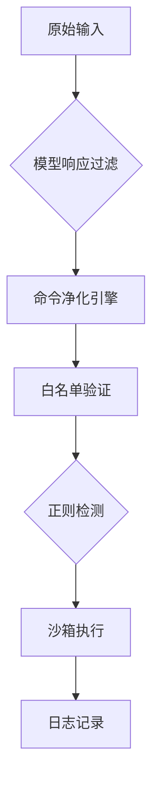
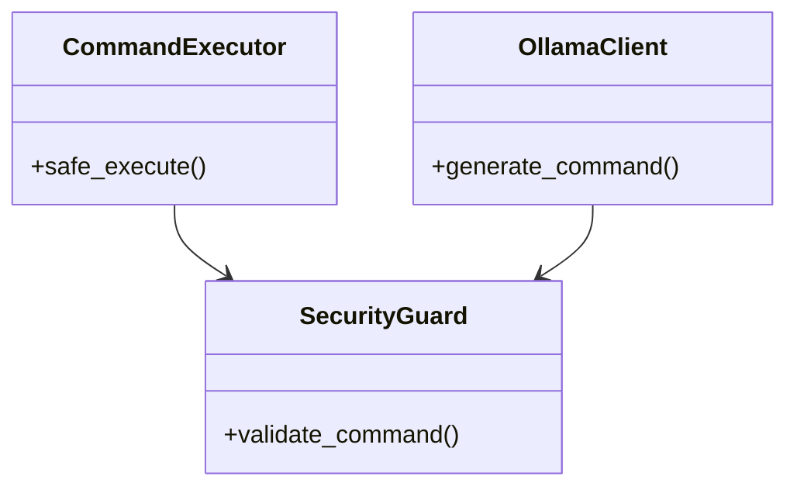

# 🤖 CommAInder - 智能指令执行系统  
  
  
  
**自然语言 → 系统命令的智能转换执行工具**  
[English](./README_EN.md) | 简体中文  

---

## 🌟 核心特性  

### 🚀 智能指令解析  
- 深度集成DeepSeek大语言模型  
- 支持自然语言指令转换（中英文双语）  
- 自动识别200+常见Windows系统操作指令  
- 毫秒级响应（平均处理时间 < 2s）  

### 🔒 五层安全防护  


### 📦 开箱即用  
```bash
# 快速安装 & 启动
pip install -r requirements.txt
python ai_open.py --mode safe

# 查看帮助文档
python ai_open.py --help
```

---

## 🛠️ 使用指南  

### 基础示例  
```console
请输入指令：打开画图程序
🔄 生成中... [耗时 1.23s]
✅ 已执行命令: mspaint

请输入指令：查看系统进程
🛑 安全拦截: tasklist.exe (未授权命令)
```

### 高级配置表  
| 配置项              | 默认值          | 说明                 |
|---------------------|-----------------|----------------------|
| ALLOWED_COMMANDS    | 基础命令集      | 可执行命令白名单     |
| MAX_RESPONSE_TIME   | 15秒            | 模型响应超时限制     |
| SECURITY_LEVEL      | 3 (严格)        | 1-5级安全策略        |
| LOG_VERBOSITY       | INFO            | 日志详细程度         |

---

## 📚 开发文档  

### 系统架构  


### 版本演进  
| 版本   | 重要更新               | 发布日期    |
|--------|------------------------|-------------|
| v0.4   | 增强命令净化逻辑        | 2025-04-05  |
| v0.3   | 增强命令净化逻辑        | 2025-04-05  |
| v0.2   | 优化模型交互性能        | 2025-04-05  |
| v0.1   | 初始版本发布            | 2025-04-05  |

---

## 📜 开源协议  
```
Copyright ©2025 GS Group All Rights Reserved.
SPDX-License-Identifier: MIT
```

---

## 🤝 贡献指南  
1. Fork本仓库  
2. 创建特性分支 (`git checkout -b feature/xxx`)  
3. 提交修改 (`git commit -m 'feat: xxx'`)  
4. 推送分支 (`git push origin feature/xxx`)  
5. 新建Pull Request  

---

## 📌 重要声明  
❗ **安全警告**  
- 本工具需在受控内网环境使用  
- 禁止开放公网访问端口  
- 建议在虚拟机环境测试  

> 📧 技术支持：GS@652789.xyz  
> 🌐 官方网站：[www.gscl.com.mp](https://www.gscl.com.mp)
```

