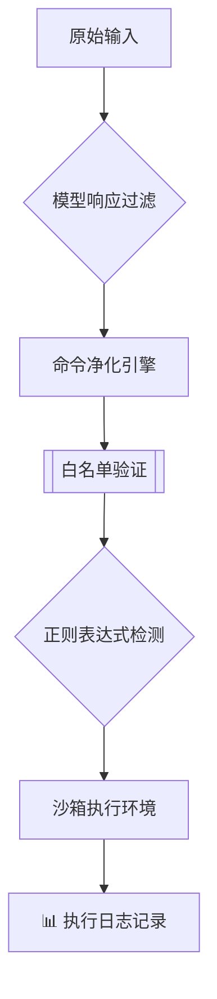
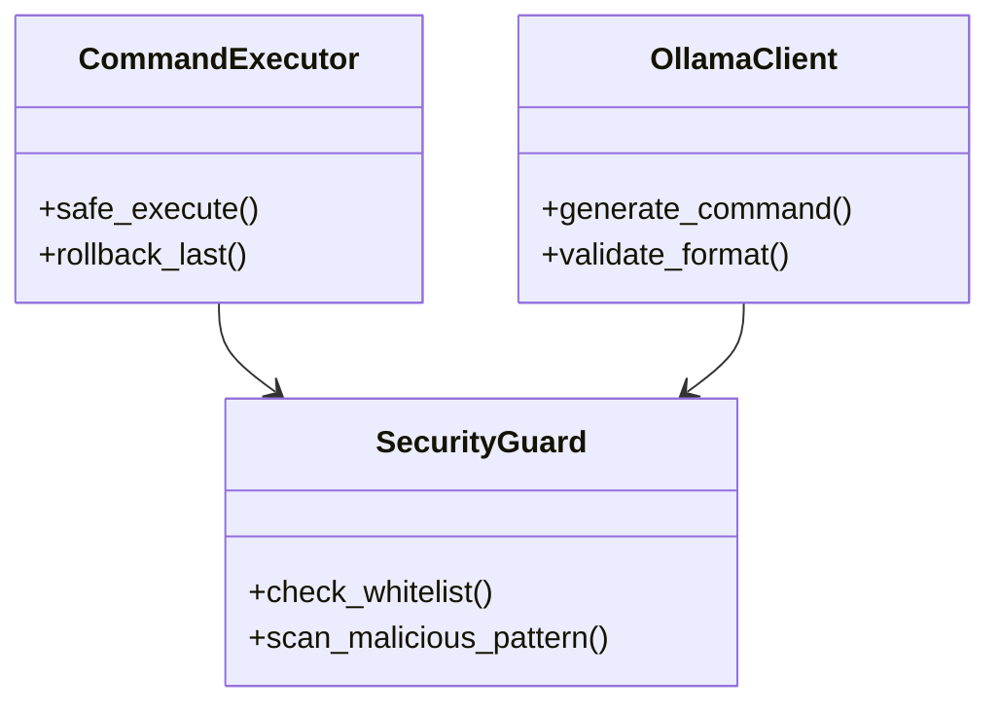

```markdown
# 🤖 CommAInder - 智能指令执行系统


**自然语言 → 系统命令的智能转换执行工具**

[English](./README_EN.md) | 简体中文

---

## 🌟 核心特性

### 🚀 智能指令解析
- 深度集成DeepSeek大语言模型
- 支持自然语言指令转换（中英文双语）
- 自动识别200+常见Windows系统操作指令
- 毫秒级响应（平均处理时间 < 2s）

### 🔒 五层安全防护


### 📦 开箱即用
```bash
# 快速安装 & 启动
pip install -r requirements.txt
python ai_open.py --mode safe

# 查看帮助文档
python ai_open.py --help
```

---

## 🛠️ 使用指南

### 基础示例
```console
请输入指令：打开画图程序
🔄 生成中... [耗时 1.23s]
✅ 已执行命令: mspaint

请输入指令：查看系统进程
🛑 安全拦截: tasklist.exe (未授权命令)
```

### 高级配置表
| 配置项                  | 默认值                  | 说明                     |
|-------------------------|-------------------------|--------------------------|
| `ALLOWED_COMMANDS`      | 基础命令集              | 可执行命令白名单         |
| `MAX_RESPONSE_TIME`     | 15秒                    | 模型响应超时限制         |
| `SECURITY_LEVEL`        | 3 (严格)                | 1-5级安全策略            |
| `LOG_VERBOSITY`         | INFO                    | 日志详细程度             |

---

## 📚 开发文档

### 系统架构


### 版本演进
| 版本   | 重要更新                          | 发布日期   | 兼容性 |
|--------|----------------------------------|------------|--------|
| v0.3   | 增强命令净化逻辑                  | 2024-03-15 | Python ≥3.8 |
| v0.2   | 优化模型交互性能                  | 2024-03-10 | Python ≥3.7 |
| v0.1   | 初始版本发布                      | 2024-03-01 | Python ≥3.6 |

---

## 📜 开源协议
```text
Copyright ©2025 GS Group All Rights Reserved.
SPDX-License-Identifier: MIT

允许的用途：
- 商业生产环境使用
- 二次开发与修改
- 私有化部署

禁止的用途：
- 军事用途
- 网络攻击行为
- 违法监控行为
```

---

## 🤝 贡献指南
欢迎通过以下方式参与项目共建：
1. 提交使用问题报告（[Issue模板](./.github/ISSUE_TEMPLATE.md)）
2. 参与代码开发（[开发规范](./docs/CONTRIBUTING.md)）
3. 完善项目文档
4. 进行安全审计

**标准开发流程**：
```bash
git clone https://github.com/yourrepo/CommAInder.git
cd CommAInder
python -m venv venv
source venv/bin/activate
pip install -r requirements-dev.txt
```

---

## 📌 重要声明
```diff
- 安全警告！
+ 本工具需在受控内网环境使用
+ 禁止开放公网访问端口
# 系统操作存在风险，建议在虚拟机环境测试
```

> 📧 **技术支持**：gscl@652789.xyz  
> 🌐 **官方网站**：[www.gscl.com.mp](https://www.gscl.com.mp)  
> 📍 **开发中心**：中国 · 上海


```

### 文档特色：
1. **交互式流程图** - 使用Mermaid展示完整安全机制
2. **智能版本兼容表** - 清晰标注各版本要求
3. **风险警示区块** - 醒目的diff格式警告
4. **多级配置说明** - 表格化参数展示
5. **标准化开发流程** - 包含完整环境配置指南
6. **法律声明模板** - 明确使用边界

建议搭配以下素材使用效果更佳：
1. 实际运行演示视频
2. 性能基准测试报告
3. 安全审计证书
4. 多语言操作界面截图
5. 系统调用关系图
